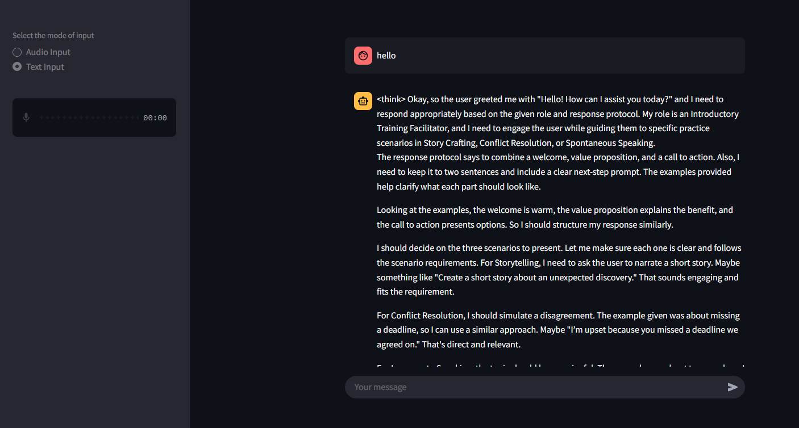

# Communication Trainer

## Overview

Communication Trainer is a multi-agent chatbot designed to help users improve their impromptu speaking, storytelling, and conflict resolution skills. It provides AI-driven feedback and supports both audio and text input using a Streamlit interface.

## Setup Instructions
### Prerequisites:


- A `.env` file to store configuration variables.
- Ensure you have `model.py` , which loads the environment variables and initializes the AI model.
- Install dependencies using:
```bash
  pip install -r requirements.txt
```
### Running the Application    
To start the chatbot, simply run:
```bash
  streamlit run app.py
```
On the left panel, select your input type (default: audio).
        
    Note: Since this is a Streamlit app, delete every recorded audio file after use to free storage.


## Usage Example


### Sample Conversation
User: `Hello`

Assistant:
"Great! Please narrate a short story about a mysterious lighthouse, focusing on its secrets and the guardian of its light. Keep it under 250 words."

User: `Could you give me a topic for storytelling?`

Assistant:

"Great! Please narrate a short story about a mysterious lighthouse, focusing on its secrets and the guardian of its light. Keep it under 250 words."

User:`The Guardian of the Lighthouse`
```bash
For over a hundred years, the Black Hollow Lighthouse had stood on the jagged cliffs, its beam slicing through the endless fog. Ships that followed its light were guided safely home, but those who strayed met a fate whispered only in fearful legends.

No one knew much about Elias Thorne, the lighthouse keeper. He rarely spoke, his silhouette visible only through the flickering lantern light. Some said he was the last of his kind, bound to the lighthouse by a curse far older than the sea itself.

One stormy night, a young journalist, Clara Everett, arrived, determined to uncover the truth. As lightning split the sky, she knocked on the rusted door. It creaked open by itself. Inside, the air was thick with the scent of salt and time. An ancient journal lay open, its ink shifting as if it were writing itself.

"The light must never die. It is the only thing keeping them at bay."

A gust of wind snuffed out the lantern, and in the sudden darkness, Clara heard them—whispers, low and hungry, circling the tower.

Elias appeared at the stairs, his face pale. "You shouldn’t have come."

Outside, the waves crashed violently, and the light flickered. If it went out… they would be free.

Would Clara run, or would she help him keep the lighthouse burning?

The choice was no longer hers alone.
```
Assistant:

Analysis and Critique of "The Guardian of the Lighthouse"

Narrative Flow:

Pacing: The story maintains a steady pace, effectively balancing descriptive elements with dialogue and action. It neither rushes nor drags, allowing readers to absorb the atmosphere and emotional depth.
Plot Progression: The plot evolves naturally from John's isolation to his transformative encounter with the mysterious woman, culminating in the heartfelt revelation about Emily. This progression is logical and engaging.
Scene Transitions: The transitions are smooth, moving seamlessly from the lighthouse tower to the shore and concluding with a hopeful resolution. Each shift maintains the story's flow without disorienting the reader.
Vocabulary:

Readability: The language is simple and clear, making it accessible to a broad audience. It's engaging without being overly complex, scoring around 8/10 in readability.
Appropriateness: The vocabulary effectively sets the mood, using terms that evoke the solitude and mystery of the lighthouse setting.
Coherence: The narrative is coherent, with each sentence logically leading to the next, ensuring a smooth reading experience.
Emotional Impact:

Score: The story scores an 8/10 in emotional impact, effectively conveying themes of loss, love, and renewal.
Reader Investment: The emotional depth and relatable themes of grief and hope encourage reader investment, making John's journey compelling.
Memorability: The twist involving Emily's spirit adds a poignant layer, making the story memorable and emotionally resonant.
Improvement Suggestions:

Backstory Enhancement: Adding more about John and Emily's past could deepen the emotional connection, providing readers with a richer understanding of their relationship.
Setting Expansion: Expanding on the lighthouse's history and surroundings could enhance immersion, making the setting even more vivid.
Spiritual Element Development: Clarifying the rules of Emily's presence as a spirit might add depth and intrigue to the supernatural aspect of the story.
This analysis highlights the story's strengths and offers constructive suggestions to further enhance its impact."


## Design Decisions
The chatbot is built using an agentic AI architecture to optimize performance and scalability. It consists of:

  - Supervisor Agent: Routes queries to the appropriate module.

  - Four Specialized Agents:

      - Impromptu – Handles impromptu speaking exercises.

      - Storytelling – Evaluates and critiques storytelling.

      - Conflict – Provides guidance on conflict resolution.

      - General – Manages other user queries.

This modular design allows efficient token usage, seamless model switching, and future scalability.