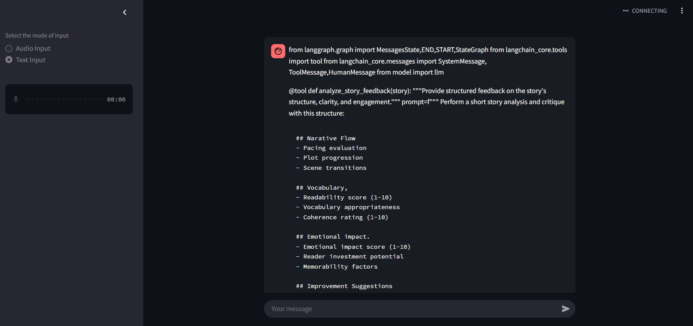

# Communication_trainer

SetUp instruction 

This is a simple chat bot that trains can train people in imprompt,storytelling and conflict resolution 
to run this code you need .env file and use model.py file to acess the env variables and initalize a model
since it is the single point for production of llm thus making choosing llm would be easy now comming to the interface 
i have used a stream lit interface 

as you can see in the image the left side you have to select the kind of input you will be choosing default is audio input since its stream lit please delete every audio after recording your audio
set up is simple as that

Example of usage :

it can be as simple as possible because 
all you have to do is start with hello the chat bot will give you and intorduction to the model 
then you can ask for topics based on a preference here is an entire conversation from hello to a storyevalutaion
user :"hello"
assistant:"Welcome! I'm here to help you enhance your storytelling, conflict resolution, and spontaneous speaking skills. Let's get started—would you like to craft a story, resolve a conflict, or speak on a topic?"

user:"could you give me a topic for a story telling"
assistante:"Great! Let’s craft a tale together. Please narrate a short story about the mysterious lighthouse, focusing on its secrets and the guardian of its light. Keep it under 250 words."
user:"The Guardian of the Lighthouse
For over a hundred years, the Black Hollow Lighthouse had stood on the jagged cliffs, its beam slicing through the endless fog. Ships that followed its light were guided safely home, but those who strayed met a fate whispered only in fearful legends.

No one knew much about Elias Thorne, the lighthouse keeper. He rarely spoke, his silhouette visible only through the flickering lantern light. Some said he was the last of his kind, bound to the lighthouse by a curse far older than the sea itself.

One stormy night, a young journalist, Clara Everett, arrived, determined to uncover the truth. As lightning split the sky, she knocked on the rusted door. It creaked open by itself. Inside, the air was thick with the scent of salt and time. An ancient journal lay open, its ink shifting as if it were writing itself.

"The light must never die. It is the only thing keeping them at bay."

A gust of wind snuffed out the lantern, and in the sudden darkness, Clara heard them—whispers, low and hungry, circling the tower.

Elias appeared at the stairs, his face pale. "You shouldn’t have come."

Outside, the waves crashed violently, and the light flickered. If it went out… they would be free.

Would Clara run, or would she help him keep the lighthouse burning?

The choice was no longer hers alone."
assistant:"Analysis and Critique of "The Guardian of the Lighthouse"

Narrative Flow:

Pacing: The story maintains a steady pace, effectively balancing descriptive elements with dialogue and action. It neither rushes nor drags, allowing readers to absorb the atmosphere and emotional depth.
Plot Progression: The plot evolves naturally from John's isolation to his transformative encounter with the mysterious woman, culminating in the heartfelt revelation about Emily. This progression is logical and engaging.
Scene Transitions: The transitions are smooth, moving seamlessly from the lighthouse tower to the shore and concluding with a hopeful resolution. Each shift maintains the story's flow without disorienting the reader.
Vocabulary:

Readability: The language is simple and clear, making it accessible to a broad audience. It's engaging without being overly complex, scoring around 8/10 in readability.
Appropriateness: The vocabulary effectively sets the mood, using terms that evoke the solitude and mystery of the lighthouse setting.
Coherence: The narrative is coherent, with each sentence logically leading to the next, ensuring a smooth reading experience.
Emotional Impact:

Score: The story scores an 8/10 in emotional impact, effectively conveying themes of loss, love, and renewal.
Reader Investment: The emotional depth and relatable themes of grief and hope encourage reader investment, making John's journey compelling.
Memorability: The twist involving Emily's spirit adds a poignant layer, making the story memorable and emotionally resonant.
Improvement Suggestions:

Backstory Enhancement: Adding more about John and Emily's past could deepen the emotional connection, providing readers with a richer understanding of their relationship.
Setting Expansion: Expanding on the lighthouse's history and surroundings could enhance immersion, making the setting even more vivid.
Spiritual Element Development: Clarifying the rules of Emily's presence as a spirit might add depth and intrigue to the supernatural aspect of the story.
This analysis highlights the story's strengths and offers constructive suggestions to further enhance its impact."

so this can be done using both the audio and text input 

Design decisions:

the design is a multiagent chatbot  i have tried to decrease the maximum no of steps to conserve the tokens ans also to keep it simple but scalabe all my code is few more lines from becomming a completey personalble and scalable application 
the reason why i went wiht agentic arcitecture is because i belive that is the future and scalling will be seamless making it effiecent and all the redirection and selection of the right model will be controlled by the ai that is the main reason why i used agentic ai so there are four modules-
-impormptu for handling imprrompty
-storytelling for handling storytelling
-conflict for conflict resolution 
-general for handling genral query
the supervisor agent redirects to the right agent
and as the name of these agents are given to the modules and also app.py contains the wrapper application as previustly mentioned model.py has the model this is created only for easy switching of the model for easy intergration of Ai based on users preference chat history json kepps track of the  history 